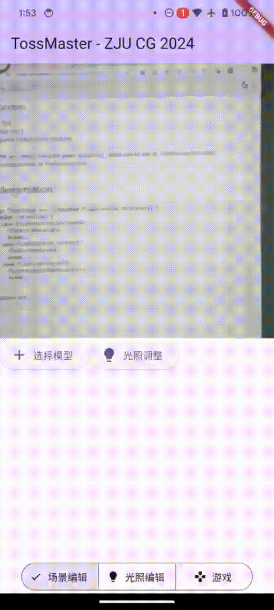
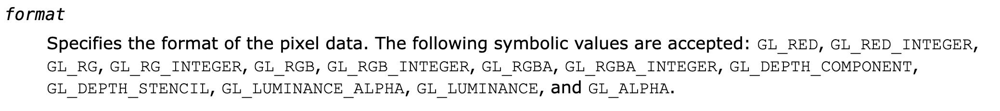
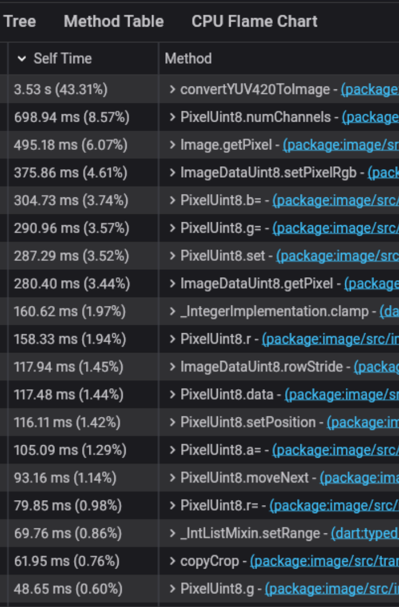
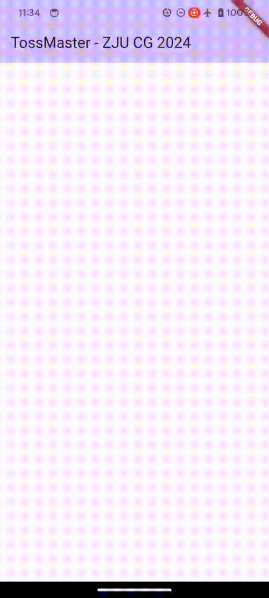
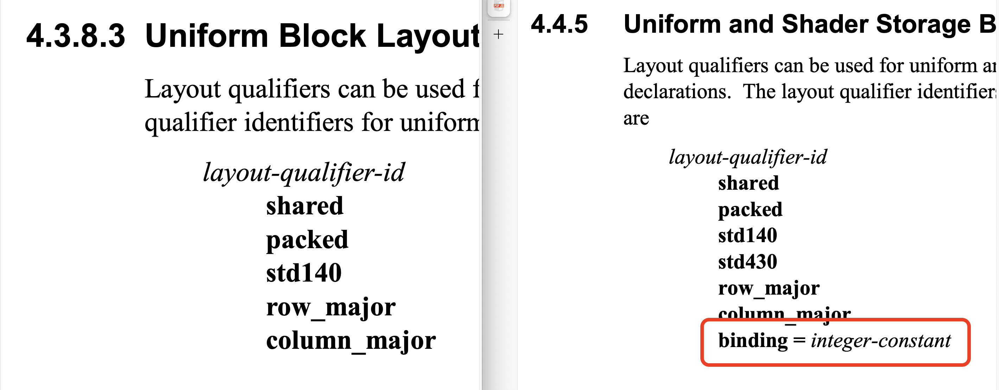
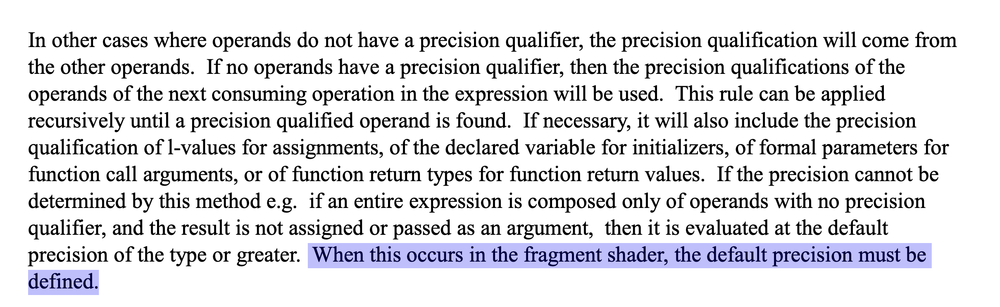

TossMaster
===

##### 基于 Flutter 框架、OpenGL ES 3.0 渲染的 3D 跨平台 AR 投掷游戏

###### by 朱宝林 杨琳玥

---

# 一、项目内容及 Demo 展示

---

## 1.1 核心玩法


---

## 1.2 项目亮点：AR 和移动端跨平台实现

本项目构思时的目标就是高级要求中的两条内容：

- （8 分）不依赖现有引擎，采用 iOS/Android 平台实现。
- （7 分）与增强现实应用结合。

---

## 1.3 基本要求：模型与纹理

- 基本体素
- OBJ 模型及其纹理导入
- 材质

---

## 1.4 基本要求：几何变换

用户与画面交互以控制模型：

- 单击选中
- 拖动平移
- 双指缩放
- 双指旋转




---

## 1.5 基本要求：光照模型

---

# 二、心得与体会

##### 充满着荆棘与坎坷的跨平台开发之路

###### 强烈不建议无移动端开发经验的同学尝试基于 OpenGL 的跨平台开发

---

## 2.1 缺少基础设施的 Flutter


极少有人在跨平台框架中直接使用 OpenGL 这类底层库进行开发。

<style scoped>
table {
 font-size: 20px;
}
blockquote {
 font-size: 18px;
}
</style>

| 项目 | 状态 |
| --- | --- |
| [google/dart-gl](https://github.com/google/dart-gl)<br/>Dart 原生 GLES2 扩展 | 2022 年停止维护 |
| [alnitak/flutter_opengl](https://github.com/alnitak/flutter_opengl)<br/>GLSL 玩具罢了😢（[ShaderToy.com](https://www.shadertoy.com/)） | 2022 年 |
| [wasabia/flutter_gl](https://github.com/wasabia/flutter_gl)<br/>通过 `dart:ffi` 绑定到 C 接口 | 2022 年 |

> Star 数均不超过 200，Flame 它不香吗？

---

### `wasabia/flutter_gl` 的绘制方式


---

## 2.2 百花齐放的图像编码

从 `startImageStream((image) async {})` 获得的 `image` 可能为：

- iOS：BGRA8888
- Android：YUV420

然而 OpenGL `glTexImage2D` 只支持 RGB、RGBA 等格式。



<!-- _footer: "*Reference [OpenGL ES 3.0 Reference Pages](https://registry.khronos.org/OpenGL-Refpages/es3.0/)*" -->

---

## 糟糕的访存模式



对于转换后 RGBA 图像的每个像素，逐次访问明度和色度平面，并且**两个平面的 Stride 不同**。

```dart
imglib.Image convertYUV420ToImage(CameraImage cameraImage) {
  for (int h = 0; h < imageHeight; h++) {
    int uvh = (h / 2).floor();
    for (int w = 0; w < imageWidth; w++) {
      int uvw = (w / 2).floor();

      final yIndex = (h * yRowStride) + (w * yPixelStride);

      final int y = yBuffer[yIndex];

      final int uvIndex = (uvh * uvRowStride) + (uvw * uvPixelStride);

      final int u = uBuffer[uvIndex];
      final int v = vBuffer[uvIndex];

      int r = (y + v * 1436 / 1024 - 179).round();
      int g = (y - u * 46549 / 131072 + 44 - v * 93604 / 131072 + 91).round();
      int b = (y + u * 1814 / 1024 - 227).round();

      r = r.clamp(0, 255); g = g.clamp(0, 255); b = b.clamp(0, 255);

      image.setPixelRgb(imageHeight - h - 1, imageWidth - w - 1, r, g, b);
    }
  }
}
```

<!-- _footer: "*Reference [Alby-o/image_converter.dart](https://gist.github.com/Alby-o/fe87e35bc21d534c8220aed7df028e03)*" -->

---

## 2.3 Dart 是一门函数式语言

Dart 是一款由 Google 开发的函数式编程语言，你将在 Flutter 框架中探索无状态和数据的不可变性......




> When the state of your app changes (for example, the user flips a switch in the settings screen), you change the state, and that triggers a **redraw of the user interface**.

---

### 拒绝重绘！

将所有状态存储在一个 Widget 中，状态变更在 Widget 内部处理。

~~然后代码变成史山，UI 和程序逻辑混杂在一起，背离函数式编程的初衷。~~

---

## 2.4 何尝不算一种 AR？

- 最初计划：借助 OpenCV 的 ArUco Marker 实现，然而
  - `opencv_dart` 缺少关键的相机姿态估计函数 `solvePnP` 和 `estimatePoseSingleMarkers` 的绑定。
  - OpenCV 相机姿态解析需要先对相机进行大量的标定（Camera Calibration），涉及计算机视觉相关的内容，难以在项目时间内完成。
- 求助 AR 框架：
  - 平台分裂：安卓 ARCore，iOS ARKit
    - `arcore_flutter_plugin` 缺少相机参数接口。
    - `arkit_plugin` 具有接口，但开发人员缺少 iOS 设备，无法测试。
  - `ar_flutter_plugin` 实现了两者的跨平台支持，但年久失修，有严重的依赖问题。
- 手搓 PnP 或 RANSAC 算法？超出课程范围。

---

## 换个思路：传感器

移动端设备具有加速度计、陀螺仪，可以感知设备的运动状态。

- 加速度计：离散采样难以获得准确的位移信息。使用 $\mathrm{d}x = v_x \cdot \mathrm{d}t + \frac{1}{2} a_x \cdot \mathrm{d}t^2$ 计算，转动时出现明显漂移，走半天却没有位移变化（无加速度）。
- 陀螺仪：角速度信息 $\mathrm{rad/s}$，可积分得到旋转角度，实测表现良好。旁轴旋转时产生偏移，暂未探究原因。

> 不同设备的传感器精度和采样率不同，需要进行校准和平滑处理。

---

## 2.5 鸿蒙与安卓亦有不同☹️

```text
OpenGL Error: 1282
Error compiling shader:
S0059: 'binding' qualifier is not allowed in language version 300 es
```



<!-- _footer: "*Reference [OpenGL ES Shading Language Version 3.00](https://www.khronos.org/registry/OpenGL/specs/es/3.0/GLSL_ES_Specification_3.00.pdf)*，OpenGL ES 3.20 得到支持" -->

---

## 寸土寸金的移动端存储

```txt
S0032: no default precision defined for variable 'varyingNormal'
L0001 The fragment matrix variable proj_matrix does not match the vertex variable proj_matrix.
  The matrix stride does not match.
```




---

# Features

- :memo: **Write slide deck with plain Markdown** (CommonMark)
- :factory: Built on [Marpit framework][marpit]: A brand-new skinny framework for creating slide deck
- :gear: [Marp Core][marp-core]: Easy to start using the core engine and built-in themes via npm
- :tv: [Marp CLI][marp-cli]: Convert Markdown into HTML, PDF, PPTX, and images
- :vs: [Marp for VS Code][marp-vscode]: Live-preview your deck while editting
- and more...

---

# How to write slides?

Split pages by horizontal ruler (e.g. `---`). It's very simple.

```markdown
# Slide 1

foobar

---

# Slide 2

foobar
```

---

# Directives

Marp has extended syntax called **"Directives"** to support creating beautiful slides.

Insert front-matter to the top of Markdown:

```
---
theme: default
---
```

or HTML comment to anywhere:

```html
<!-- theme: default -->
```

<https://marpit.marp.app/directives>

---

## [Global directives](https://marpit.marp.app/directives?id=global-directives)

- `theme`: Choose theme
- `size`: Choose slide size from `16:9` and `4:3` *(except Marpit framework)*
- [`headingDivider`](https://marpit.marp.app/directives?id=heading-divider): Instruct to divide slide pages at before of specified heading levels

```
---
theme: gaia
size: 4:3
---

# Content
```

> Marp can use [built-in themes in Marp Core](https://github.com/marp-team/marp-core/tree/master/themes#readme): `default`, `gaia`, and `uncover`.

---

## [Local directives](https://marpit.marp.app/directives?id=local-directives)

These are the setting value per slide pages.

- `paginate`: Show pagination by set `true`
- `header`: Specify the contents for header
- `footer`: Specify the contents for footer
- `class`: Set HTML class for current slide
- `color`: Set text color
- `backgroundColor`: Set background color

---

### Spot directives

Local directives would apply to **defined page and following pages**.

They can apply to single page by using underscore prefix such as `_class`.


---

### Example

This page is using invert color scheme [defined in Marp built-in theme](https://github.com/marp-team/marp-core/tree/master/themes#readme).

<!-- _class: invert -->

```html
<!-- _class: invert -->
```

---

# [Image syntax](https://marpit.marp.app/image-syntax)

You can resize image size and apply filters through keywords: `width` (`w`), `height` (`h`), and filter CSS keywords.

```markdown

```

```markdown

```

Please refer [resizing image syntax](https://marpit.marp.app/image-syntax?id=resizing-image) and [a list of CSS filters](https://marpit.marp.app/image-syntax?id=image-filters).

 

---

# [Background image](https://marpit.marp.app/image-syntax?id=slide-backgrounds)

You can set background image for a slide by using `bg` keyword.

```markdown

```


---

## Multiple backgrounds ([Marpit's advanced backgrounds](https://marpit.marp.app/image-syntax?id=advanced-backgrounds))

Marp can use multiple background images.

```markdown


```

Also can change alignment direction by including `vertical` keyword.


---

## [Split background](https://marpit.marp.app/image-syntax?id=split-backgrounds)

Marp can use [Deckset](https://docs.deckset.com/English.lproj/Media/01-background-images.html#split-slides) style split background(s).

Make a space for background by `bg` + `left` / `right` keywords.

```markdown

```


<!-- _footer: "*Photo by [Mohamed Nohassi](https://unsplash.com/@coopery?utm_source=unsplash&utm_medium=referral&utm_content=creditCopyText) on [Unsplash](https://unsplash.com/?utm_source=unsplash&utm_medium=referral&utm_content=creditCopyText)*" -->

---

## [Fragmented list](https://marpit.marp.app/fragmented-list)

Marp will parse a list with asterisk marker as the fragmented list for appearing contents one by one. (***Only for exported HTML** by [Marp CLI][marp-cli] / [Marp for VS Code][marp-vscode]*)

```markdown
# Bullet list

- One
- Two
- Three

---

# Fragmented list

* One
* Two
* Three
```

---

## Math typesetting (only for [Marp Core][marp-core])

[KaTeX](https://katex.org/) math typesetting such as $ax^2+bc+c$ can use with [Pandoc's math syntax](https://pandoc.org/MANUAL.html#math).

$$I_{xx}=\int\int_Ry^2f(x,y)\cdot{}dydx$$

```tex
$ax^2+bc+c$
```

```tex
$$I_{xx}=\int\int_Ry^2f(x,y)\cdot{}dydx$$
```

---

## Auto-scaling (only for [Marp Core][marp-core])

*Several built-in themes* are supported auto-scaling for code blocks and math typesettings.

```text
Too long code block will be scaled-down automatically. ------------>
```

```text
Too long code block will be scaled-down automatically. ------------------------>
```

```text
Too long code block will be scaled-down automatically. ------------------------------------------------>
```

---

##### <!--fit--> Auto-fitting header (only for [Marp Core][marp-core])

##### <!--fit--> is available by annotating `<!--fit-->` in headings

<br />

```html
## <!--fit--> Auto-fitting header (only for Marp Core)
```

---

## [Theme CSS](https://marpit.marp.app/theme-css)

Marp uses `<section>` as the container of each slide. And others are same as styling for plain Markdown. The customized theme can use in [Marp CLI][marp-cli] and [Marp for VS Code][marp-vscode].

```css
/* @theme your-theme */

@import 'default';

section {
  /* Specify slide size */
  width: 960px;
  height: 720px;
}

h1 {
  font-size: 30px;
  color: #c33;
}
```

---

## [Tweak style in Markdown](https://marpit.marp.app/theme-css?id=tweak-style-through-markdown)

`<style>` tag in Markdown will work in the context of theme CSS.

```markdown
---
theme: default
---

<style>
section {
  background: yellow;
}
</style>

Re-painted yellow background, ha-ha.
```

> You can also add custom styling by class like `section.custom-class { ... }`.
> Apply style through `<!-- _class: custom-class -->`.

---

## [Scoped style](https://marpit.marp.app/theme-css?id=scoped-style)

If you want one-shot styling for current page, you can use `<style scoped>`.

```markdown
<style scoped>
a {
  color: green;
}
</style>


```

<style scoped>
a { color: green; }
</style>

---

# Enjoy writing slides! :v: <!--fit-->

#####   Marp: Markdown presentation ecosystem — <https://marp.app/>

###### by Marp Team ([@marp-team][marp-team])
