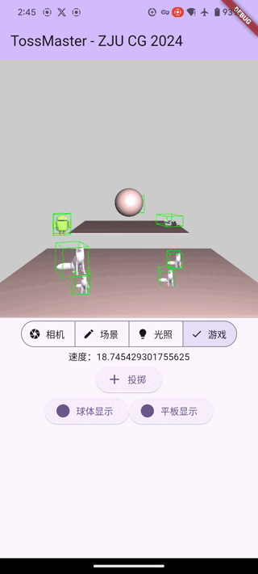
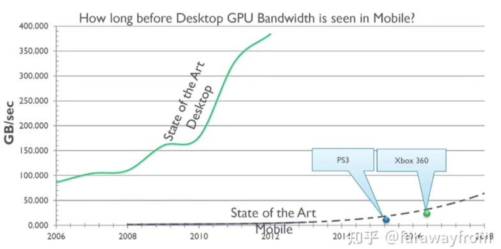
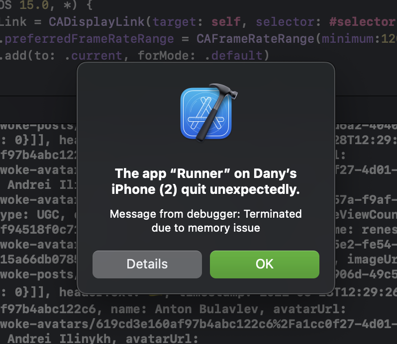

TossMaster
===

##### 基于 Flutter 框架、OpenGL ES 3.0 渲染的 3D 跨平台 AR 投掷游戏

###### 浙江大学 2024 学年秋冬学期《计算机图形学》课程项目展示

###### by 朱宝林 杨琳玥

---

# 一、项目内容及 Demo 展示

---

## 1.1 核心玩法：投掷游戏

蓄力 ➡️ 投掷 ➡️ 命中

TODO



---

## 1.2 项目亮点：AR 和移动端跨平台实现

- AR：场景中的物体能够跟随相机视角，营造出虚拟与现实共享同一空间的体验。
- 移动端跨平台实现：借助 Flutter 框架，在 Android、HarmonyOS 和 iOS 上完成适配。

> 本项目构思时的目标就是高级要求中的两条内容：
>
> - （8 分）不依赖现有引擎，采用 iOS/Android 平台实现。
> - （7 分）与增强现实应用结合。

TODO：


---

## 1.3 基本要求：OBJ 模型及其纹理导入

- 用户导入模型，存储在模型库中。
- 导入模型同时可以选择导入纹理和展示用的 GIF。
- 用户选择模型库中的模型，将其放置在场景中。

---

## 1.4 基本要求：几何变换

用户与画面交互以控制模型：

- 单击选中
- 拖动平移
- 双指缩放
- 双指旋转


---

## 1.5 基本要求：Blinn-Phong 着色的 ADS 光照模型及材质

- Blinn-Phong 着色在 Phong 的基础上节省了大量性能损耗，适合移动端渲染。
- 两个光源，用户可控：
  - 全局光：没有方向，仅有 A（环境光）分量，对每个像素具有相同的光照。
  - 定向光（远距离光）：具有方向和 A（环境光）、D（漫反射光）、S（镜面光）三个反射分量。
- 材质：ADS + 光泽，预置金、银、铜、玉、珍珠材质。


---

## 1.6 基本要求：

---

## 1.7 高级要求：

---

# 二、心得与体会

##### 充满着荆棘与坎坷的移动端开发之路

###### ~~强烈不建议无移动端开发经验的同学尝试在跨平台框架上做 OpenGL 开发~~


---

## 2.0 捉襟见肘的移动端资源：功耗、带宽与 TBR



可怜的 GPU 尺寸和功耗需求：我打 PC 端？尊嘟假嘟 o_O

- 移动端：分块渲染（TBR，Tile-Based Rendering），将帧缓冲分割为一小块一小块，然后逐块进行渲染。
- 桌面端：即时渲染（IMR，Immediate Mode Rendering），一次性渲染整个帧缓冲，需要大量的带宽。

<!-- _footer: "*Reference [渲染架构比较：IMR、TBR & TBDR - 知乎](https://zhuanlan.zhihu.com/p/390625258)*" -->

---

## 2.1 缺少基础设施的 Flutter


极少有人在跨平台框架中直接使用 OpenGL 这类底层库进行开发。

<style scoped>
table {
 font-size: 25px;
}
blockquote {
 font-size: 18px;
}
</style>

| 项目 | 状态 |
| --- | --- |
| [google/dart-gl](https://github.com/google/dart-gl)<br/>Dart 原生 GLES2 扩展 | 停止维护<br/>2022 年 |
| [alnitak/flutter_opengl](https://github.com/alnitak/flutter_opengl)<br/>GLSL 玩具罢了😢（[ShaderToy.com](https://www.shadertoy.com/)） | 上次更新<br/>2022 年 |
| [wasabia/flutter_gl](https://github.com/wasabia/flutter_gl)<br/>通过 `dart:ffi` 绑定到 C 接口 | 上次更新<br/>2022 年 |

> Star 数均不超过 200，Flame 它不香吗？

---

### `wasabia/flutter_gl` 的绘制方式

- 在 Dart 中离屏渲染到 FrameBuffer
- 将 FBO 的颜色纹理附件传递给 Native Texture Widget


---

## 2.2 百花齐放的图像编码

从 `startImageStream((image) async {})` 获得的 `image` 可能为：

- iOS：BGRA8888
- Android：YUV420（适用于视频流的一种编码，将明度与颜色分开存储，在低带宽时能够只显示黑白画面）

然而 OpenGL `glTexImage2D` 只支持 RGB、RGBA 等格式。


<!-- _footer: "*Reference [OpenGL ES 3.0 Reference Pages](https://registry.khronos.org/OpenGL-Refpages/es3.0/)*" -->

---

## 糟糕的访存模式（YUV420）


对于转换后 RGBA 图像的每个像素，逐次访问明度和色度平面，并且**两个平面的 Stride 不同**。

让本就不高的带宽雪上加霜🤬🤬🤬

```dart
for (int h = 0; h < imageHeight; h++) {
  int uvh = (h / 2).floor();
  for (int w = 0; w < imageWidth; w++) {
    int uvw = (w / 2).floor();
    final yIndex = (h * yRowStride) + (w * yPixelStride);
    final int y = yBuffer[yIndex];
    final int uvIndex = (uvh * uvRowStride) + (uvw * uvPixelStride);
    final int u = uBuffer[uvIndex]; final int v = vBuffer[uvIndex];
    int r = (y + v * 1436 / 1024 - 179).round();
    int g = (y - u * 46549 / 131072 + 44 - v * 93604 / 131072 + 91).round();
    int b = (y + u * 1814 / 1024 - 227).round();
    r = r.clamp(0, 255); g = g.clamp(0, 255); b = b.clamp(0, 255);
    image.setPixelRgb(imageHeight - h - 1, imageWidth - w - 1, r, g, b);
  }
}
```

<!-- _footer: "*Reference [Alby-o/image_converter.dart](https://gist.github.com/Alby-o/fe87e35bc21d534c8220aed7df028e03)*" -->

---

## 2.3 Dart 是一门函数式语言


> When the state of your app changes (for example, the user flips a switch in the settings screen), you change the state, and that triggers a **redraw of the user interface**.

---

### 拒绝重绘！

将所有状态存储在一个 Widget 中，状态变更在 Widget 内部处理。

~~然后代码变成💩山，UI 和程序逻辑混杂在一起，背离函数式编程的初衷。~~

---

## 2.4 AR：如何实现？

- 最初计划：借助 OpenCV 的 ArUco Marker 实现，然而
    - `opencv_dart` 缺少关键的相机姿态估计函数 `solvePnP` 和 `estimatePoseSingleMarkers` 的绑定。
    - OpenCV 相机姿态解析需要先对相机进行大量的标定（Camera Calibration），涉及计算机视觉相关的内容，难以在项目时间内完成。
- 求助 AR 框架：
    - 平台分裂：安卓 ARCore，iOS ARKit
        - `arcore_flutter_plugin` 缺少相机参数接口。
        - `arkit_plugin` 具有接口，但开发人员缺少 iOS 设备，无法测试。
    - `ar_flutter_plugin` 实现了两者的跨平台支持，但年久失修，有严重的依赖问题。
- 手搓 PnP 或 RANSAC 算法？超出课程范围。

---

## 换个思路：传感器

移动端设备具有加速度计、陀螺仪，可以感知设备的运动状态。

- 加速度计：离散采样难以获得准确的位移信息。比如使用 $\mathrm{d}x = v_x \cdot \mathrm{d}t + \frac{1}{2} a_x \cdot \mathrm{d}t^2$ 计算，摇一摇直接起飞，平稳地走半天却没有位移变化。
- 陀螺仪：角速度信息 $\mathrm{rad/s}$，可积分得到旋转角度，实测表现良好。旁轴旋转时产生偏移，暂未探究原因。

> 不同设备的传感器精度和采样率不同，需要进行校准和平滑处理。

---

## 2.5 鸿蒙与安卓亦有不同☹️

```text
OpenGL Error: 1282
Error compiling shader:
S0059: 'binding' qualifier is not allowed in language version 300 es
```


<!-- _footer: "*Reference [OpenGL ES Shading Language Version 3.00](https://www.khronos.org/registry/OpenGL/specs/es/3.0/GLSL_ES_Specification_3.00.pdf)*，OpenGL ES 3.20 得到支持" -->

---

## 2.6 寸土寸金的移动端存储

```txt
S0032: no default precision defined for variable 'varyingNormal'
```


- 着色器中必须指定默认精度，为 Float16。
- 帧缓冲区爆内存：善用 `glClear`、`glInvalidateFramebuffer`。



---

## 2.7 Awesome 指数


---

# Welcome Play :v: <!--fit-->

##### TossMaster：基于 Flutter 框架、OpenGL ES 3.0 渲染的 3D 跨平台 AR 投掷游戏

###### 浙江大学 2024 学年秋冬学期《计算机图形学》课程项目展示

###### by 朱宝林 杨琳玥

---

# Features

- :memo: **Write slide deck with plain Markdown** (CommonMark)
- :factory: Built on [Marpit framework][marpit]: A brand-new skinny framework for creating slide deck
- :gear: [Marp Core][marp-core]: Easy to start using the core engine and built-in themes via npm
- :tv: [Marp CLI][marp-cli]: Convert Markdown into HTML, PDF, PPTX, and images
- :vs: [Marp for VS Code][marp-vscode]: Live-preview your deck while editting
- and more...

---

# How to write slides?

Split pages by horizontal ruler (e.g. `---`). It's very simple.

```markdown
# Slide 1

foobar

---

# Slide 2

foobar
```

---

# Directives

Marp has extended syntax called **"Directives"** to support creating beautiful slides.

Insert front-matter to the top of Markdown:

```
---
theme: default
---
```

or HTML comment to anywhere:

```html
<!-- theme: default -->
```

<https://marpit.marp.app/directives>

---

## [Global directives](https://marpit.marp.app/directives?id=global-directives)

- `theme`: Choose theme
- `size`: Choose slide size from `16:9` and `4:3` *(except Marpit framework)*
- [`headingDivider`](https://marpit.marp.app/directives?id=heading-divider): Instruct to divide slide pages at before of specified heading levels

```
---
theme: gaia
size: 4:3
---

# Content
```

> Marp can use [built-in themes in Marp Core](https://github.com/marp-team/marp-core/tree/master/themes#readme): `default`, `gaia`, and `uncover`.

---

## [Local directives](https://marpit.marp.app/directives?id=local-directives)

These are the setting value per slide pages.

- `paginate`: Show pagination by set `true`
- `header`: Specify the contents for header
- `footer`: Specify the contents for footer
- `class`: Set HTML class for current slide
- `color`: Set text color
- `backgroundColor`: Set background color

---

### Spot directives

Local directives would apply to **defined page and following pages**.

They can apply to single page by using underscore prefix such as `_class`.


---

### Example

This page is using invert color scheme [defined in Marp built-in theme](https://github.com/marp-team/marp-core/tree/master/themes#readme).

<!-- _class: invert -->

```html
<!-- _class: invert -->
```

---

# [Image syntax](https://marpit.marp.app/image-syntax)

You can resize image size and apply filters through keywords: `width` (`w`), `height` (`h`), and filter CSS keywords.

```markdown

```

```markdown

```

Please refer [resizing image syntax](https://marpit.marp.app/image-syntax?id=resizing-image) and [a list of CSS filters](https://marpit.marp.app/image-syntax?id=image-filters).

 

---

# [Background image](https://marpit.marp.app/image-syntax?id=slide-backgrounds)

You can set background image for a slide by using `bg` keyword.

```markdown

```


---

## Multiple backgrounds ([Marpit's advanced backgrounds](https://marpit.marp.app/image-syntax?id=advanced-backgrounds))

Marp can use multiple background images.

```markdown


```

Also can change alignment direction by including `vertical` keyword.


---

## [Split background](https://marpit.marp.app/image-syntax?id=split-backgrounds)

Marp can use [Deckset](https://docs.deckset.com/English.lproj/Media/01-background-images.html#split-slides) style split background(s).

Make a space for background by `bg` + `left` / `right` keywords.

```markdown

```


<!-- _footer: "*Photo by [Mohamed Nohassi](https://unsplash.com/@coopery?utm_source=unsplash&utm_medium=referral&utm_content=creditCopyText) on [Unsplash](https://unsplash.com/?utm_source=unsplash&utm_medium=referral&utm_content=creditCopyText)*" -->

---

## [Fragmented list](https://marpit.marp.app/fragmented-list)

Marp will parse a list with asterisk marker as the fragmented list for appearing contents one by one. (***Only for exported HTML** by [Marp CLI][marp-cli] / [Marp for VS Code][marp-vscode]*)

```markdown
# Bullet list

- One
- Two
- Three

---

# Fragmented list

* One
* Two
* Three
```

---

## Math typesetting (only for [Marp Core][marp-core])

[KaTeX](https://katex.org/) math typesetting such as $ax^2+bc+c$ can use with [Pandoc's math syntax](https://pandoc.org/MANUAL.html#math).

$$I_{xx}=\int\int_Ry^2f(x,y)\cdot{}dydx$$

```tex
$ax^2+bc+c$
```

```tex
$$I_{xx}=\int\int_Ry^2f(x,y)\cdot{}dydx$$
```

---

## Auto-scaling (only for [Marp Core][marp-core])

*Several built-in themes* are supported auto-scaling for code blocks and math typesettings.

```text
Too long code block will be scaled-down automatically. ------------>
```

```text
Too long code block will be scaled-down automatically. ------------------------>
```

```text
Too long code block will be scaled-down automatically. ------------------------------------------------>
```

---

##### <!--fit--> Auto-fitting header (only for [Marp Core][marp-core])

##### <!--fit--> is available by annotating `<!--fit-->` in headings

<br />

```html
## <!--fit--> Auto-fitting header (only for Marp Core)
```

---

## [Theme CSS](https://marpit.marp.app/theme-css)

Marp uses `<section>` as the container of each slide. And others are same as styling for plain Markdown. The customized theme can use in [Marp CLI][marp-cli] and [Marp for VS Code][marp-vscode].

```css
/* @theme your-theme */

@import 'default';

section {
  /* Specify slide size */
  width: 960px;
  height: 720px;
}

h1 {
  font-size: 30px;
  color: #c33;
}
```

---

## [Tweak style in Markdown](https://marpit.marp.app/theme-css?id=tweak-style-through-markdown)

`<style>` tag in Markdown will work in the context of theme CSS.

```markdown
---
theme: default
---

<style>
section {
  background: yellow;
}
</style>

Re-painted yellow background, ha-ha.
```

> You can also add custom styling by class like `section.custom-class { ... }`.
> Apply style through `<!-- _class: custom-class -->`.

---

## [Scoped style](https://marpit.marp.app/theme-css?id=scoped-style)

If you want one-shot styling for current page, you can use `<style scoped>`.

```markdown
<style scoped>
a {
  color: green;
}
</style>


```

<style scoped>
a { color: green; }
</style>

---

# Enjoy writing slides! :v: <!--fit-->

#####   Marp: Markdown presentation ecosystem — <https://marp.app/>

###### by Marp Team ([@marp-team][marp-team])
